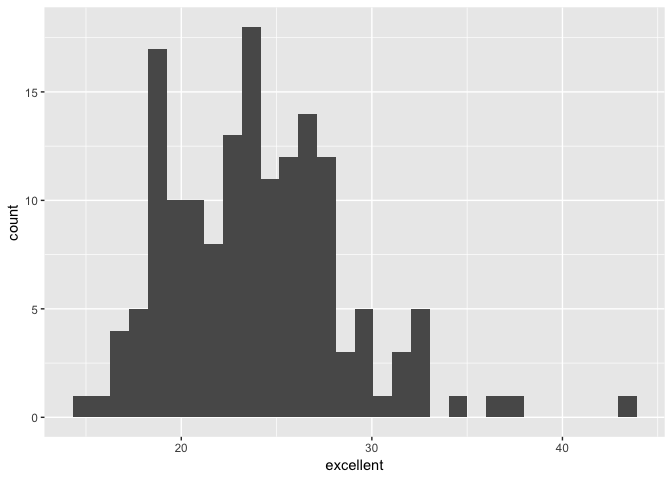
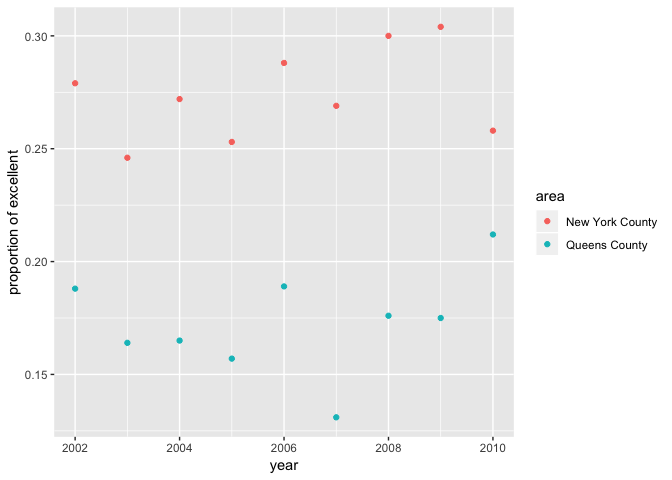

P8105 Homework 2 Problem 3
================
Zanis Fang
9/26/2018

### load data and data cleaning:

``` r
# make a copy of the data frame
brfss <- p8105.datasets::brfss_smart2010

# clean the data
brfss <- brfss %>% 
    # get Overall Health topic
    filter(Topic == "Overall Health") %>%
    # remove unwanted variables
    select(-Class, -Topic, -Question, -Sample_Size, -(Confidence_limit_Low:GeoLocation)) %>% 
  # make human readable table
    spread(key = Response, value = Data_value) %>% 
    # clean column name
    janitor::clean_names() %>% 
    # rearrange the columns, remove locationabbr, which is included in locationdesc
    select(year, locationdesc, excellent, very_good, good, fair, poor) %>%
    # seperate locationdesc into state and area (county and municipal)
    separate(locationdesc, c("state", "area"), sep = " - ")

# For each location, the sum of values from excellent to poor is roughly 100

# create a function to fill NA values with mean of the column
remove_na <- function(ncolumn) {
    # For tibble dataset, double square bracket is needed for mean function
    ncolumn[which(is.na(ncolumn))] <- mean(ncolumn[[1]], na.rm = TRUE)
    return(ncolumn)
}

# fill the NAs
brfss[4:8] <- sapply(brfss[4:8], remove_na)

# calculate the proportion of excellent and very good ones
# for each location total is roughly 100
brfss <- mutate(brfss,
                                prop_high = (excellent + very_good) / 100)
```

### Answer questions:

**How many unique locations are included in the dataset? Is every state represented? What state is observed the most?**

``` r
# count the represents in each state
state_reps <- brfss %>% 
                group_by(state) %>%
                summarize(n()) %>%
                rename("represents" = "n()")
```

There are 404 unique locations. There are 51 states, all states are represented. The state observed most is NJ. </br>

**In 2002, what is the median of the “Excellent” response value?** </br> Median is 23.8.

**Make a histogram of “Excellent” response values in the year 2002.**

``` r
# making histogram of excellent in 2002
ggplot(brfss[which(brfss$year == 2002),], aes(x = excellent)) + geom_histogram()
```



**Make a scatterplot showing the proportion of “Excellent” response values in New York County and Queens County (both in NY State) in each year from 2002 to 2010.**

``` r
# create a variable for plotting
brfss_ny_qs <- brfss %>% filter(state == "NY", area %in% c("New York County", "Queens County"))

# plot scatterplot of excellent in New York and Queens counties
ggplot(brfss_ny_qs, aes(x = year, y = excellent / 100, color = area)) + 
    geom_point() +
    ylab("proportion of excellent")
```


