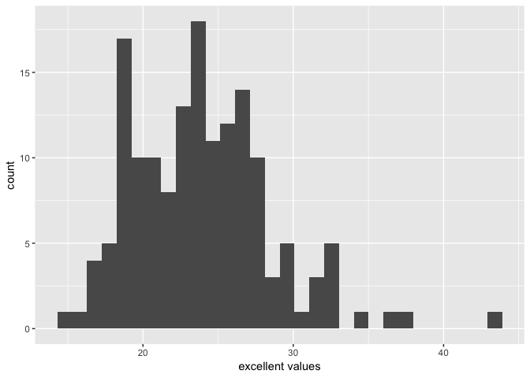
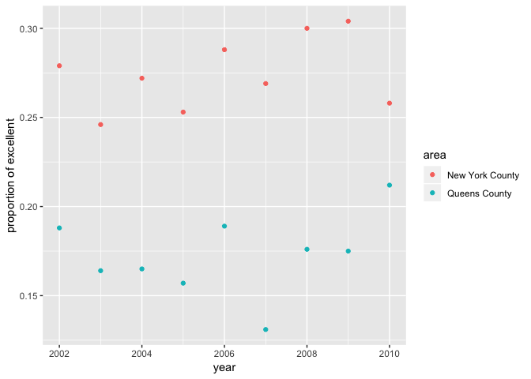

P8105\_hw2\_zf2213
================
Zanis Fang, UID: ZF2213
10/4/2018

Problem 1
---------

### Data loading and cleaning

``` r
# load data
nyc_transit <- read_csv(file = "./data/NYC_Transit_Subway_Entrance_And_Exit_Data.csv")

# data cleaning
nyc_transit <- nyc_transit %>% 
               janitor::clean_names() %>% 
               #select needed rows
               select(line:ada, -exit_only, -staffing, -staff_hours)  %>%
               #recode entry to logic
               mutate(entry = recode(entry, "YES" = TRUE, "NO" = FALSE))
```

Each row represents an entrance. The dataframe contains line names, station names, station location, connected train routes, type of entrance, entry or exit, has vending or not, ADA compliant or not. Use "janitor::clean\_names" to clean the column names, select indicated columns, and change entry to TRUE or FALSE. There are 1868 rows, 19 columns. The data is not tidy. The route 1-11 are actually data rather than variable. Besides, data type should be TRUE or FALSE instead of YES or NO.

*Q1. How many distinct stations are there? Note that stations are identified both by name and by line (e.g. 125th St A/B/C/D; 125st 1; 125st 4/5); the distinct function may be useful here.*

``` r
#unique station with ADA compliant information
station_ada <- distinct(nyc_transit, line, station_name, ada)
```

There are 465 distinct stations.

*Q2. How many stations are ADA compliant?*

There are 84 stations which are ADA compliant.

*Q3. What proportion of station entrances / exits without vending allow entrance?*

``` r
entry_no_vending <- nyc_transit %>% filter(vending == "NO", entry == TRUE)
no_vending <- nyc_transit %>% filter(vending == "NO")
```

The proportion of station entrances/exits without vending is 0.3770492.

### Reform table

``` r
nyc_transit <- gather(nyc_transit, key = "route_number", value = "route_name", route1:route11)

# distinct station serve A train with ADA information
station_train_a <- nyc_transit %>%
                   distinct(line, station_name, route_name, ada) %>% 
                   filter(route_name == "A")
```

*Q4. How many distinct stations serve the A train? Of the stations that serve the A train, how many are ADA compliant?*

There are 60 stations serve the A train, among which 17 are ADA compliant.

Problem 2
---------

### Read and clean the Mr. Trash Wheel sheet

``` r
#load data
trash_wheel <- readxl::read_xlsx("./data/HealthyHarborWaterWheelTotals2018-7-28.xlsx",
                                 sheet = 1,
                                 range = readxl::cell_cols("A:N"))

trash_wheel <- trash_wheel %>%
               janitor::clean_names() %>%
               # omit rows counting totals, note only dumpsters have date information
               filter(!is.na(date)) %>%
               # convert sports balls to integer variable
               mutate(sports_balls = sports_balls %>% round(0) %>% as.integer())
```

Read and clean precipitation data from 2016 and 2017
----------------------------------------------------

``` r
# define a function to load data and clean data
prcp_load_clean <- function(wh_year) {
 
 # load data
 readxl::read_xlsx("./data/HealthyHarborWaterWheelTotals2018-7-28.xlsx",
                   sheet = paste(wh_year, "Precipitation"),
                   range = "A2:B14"
                   ) %>%
  
  janitor::clean_names() %>%
  # remove rows without data
  filter(!is.na(total)) %>%
  # add year variable
  mutate(year = wh_year)
           
}

# combine two tables
prcp_data <- rbind(prcp_load_clean(2016), prcp_load_clean(2017))

# convert month to a character variable
prcp_data$month <- month.name[prcp_data$month]
```

*Description:*

In Mr. Trash Wheel data, it describes the amount of trash each dumpster colloects. There are 285 individual dumpsters. In each dumpster, it categorizes the kind of trash, like "plastic bags", "cigarette butts", etc. For precipitation data in 2017, there are in total 32.93 inch precipitation. The median number of sports balls in a dumpster in 2016 is 26.

Problem 3
---------

### load data and data cleaning:

``` r
# make a copy of the data frame
brfss <- p8105.datasets::brfss_smart2010

# clean the data
brfss <- brfss %>% 
    # get Overall Health topic
    filter(Topic == "Overall Health") %>%
    # remove unwanted variables
    select(-Class, -Topic, -Question, -Sample_Size, -(Confidence_limit_Low:GeoLocation)) %>%
    # make human readable table
    spread(key = Response, value = Data_value) %>% 
    # clean column name
    janitor::clean_names() %>% 
    # rearrange the columns, remove locationabbr, which is included in locationdesc
    select(year, locationdesc, excellent, very_good, good, fair, poor) %>%
    # seperate locationdesc into state and area (county and municipal)
    separate(locationdesc, c("state", "area"), sep = " - ")

# calculate the proportion of excellent and very good ones
# for each location total is roughly 100, to be simple
brfss <- mutate(brfss, prop_high = (excellent + very_good) / 100)
```

### answers to questions:

*Q1. How many unique locations are included in the dataset? Is every state represented? What state is observed the most?*

``` r
# count the represents in each state
state_reps <- brfss %>% 
              group_by(state) %>%
              summarize(n()) %>%
              rename("represents" = "n()")
```

There are 404 unique locations. There are 51 states, all states are represented. The state observed most is NJ.

*Q2. In 2002, what is the median of the “Excellent” response value?*

Median is 23.6.

*Q3. Make a histogram of “Excellent” response values in the year 2002.*

``` r
# making histogram of excellent in 2002
ggplot(brfss[which(brfss$year == 2002),], aes(x = excellent)) +
  geom_histogram() +
  labs(x = "excellent values")
```



*Q4. Make a scatterplot showing the proportion of “Excellent” response values in New York County and Queens County (both in NY State) in each year from 2002 to 2010.*

``` r
# create a variable for plotting
brfss_ny_qs <- brfss %>% filter(state == "NY", area %in% c("New York County", "Queens County"))

# plot scatterplot of excellent in New York and Queens counties
ggplot(brfss_ny_qs, aes(x = year, y = excellent / 100, color = area)) + 
  geom_point() +
  labs(y = "proportion of excellent")
```


